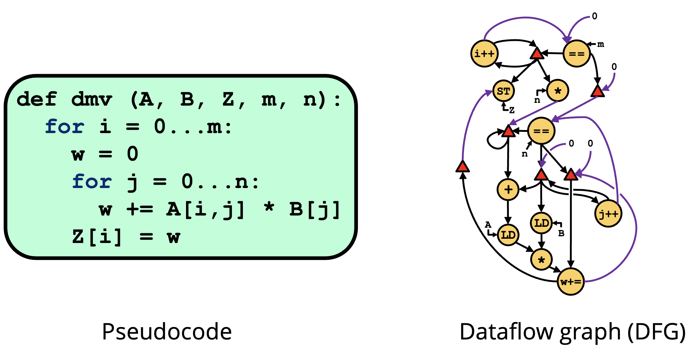
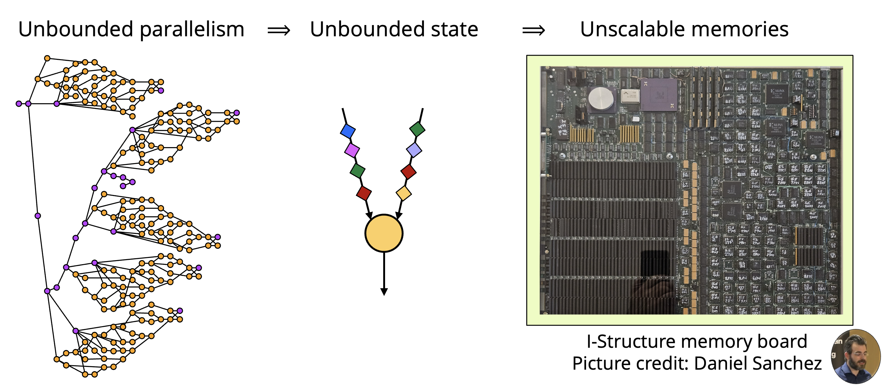
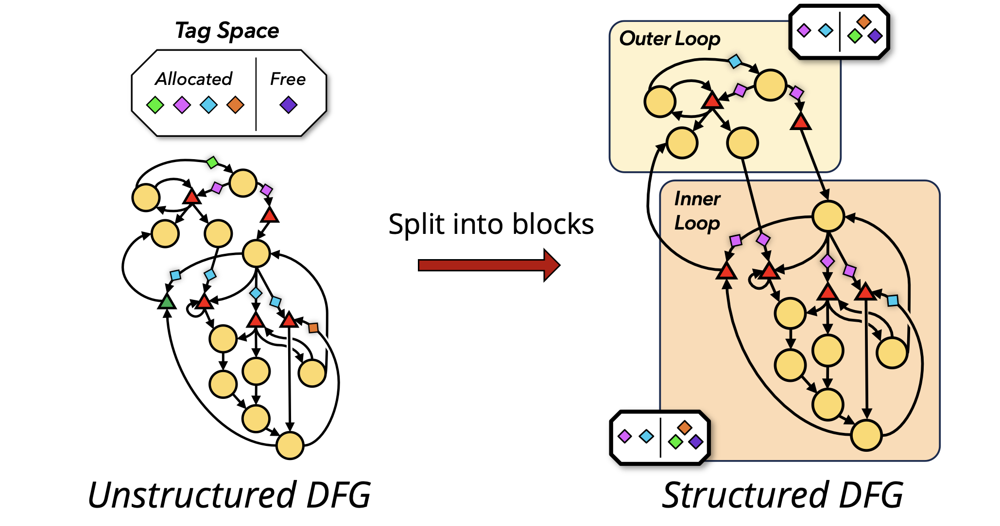
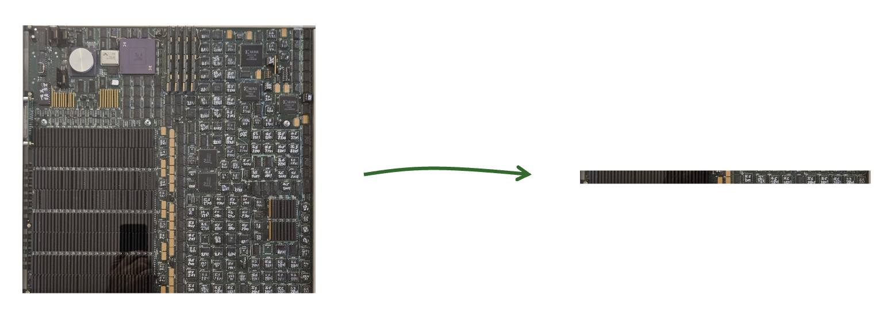

### Problem Statement

The end of Dennard scaling has made processors power-limited, and conventional CPU architectures are horribly inefficient, wasting upwards of 99% of their energy. 
The familiar von Neumann (vN) paradigm takes a sequential view of a program, forcing hardware to employ hard-to-scale, complex mechanisms to rediscover program parallelism at runtime. 
Worse, this extra complexity comes at the expense of energy efficiency. 
Simple, fixed function hardware can be made extremely efficient for a given task, so some foresee a future where systems feature a wide variety of specialized accelerators. 
However, ***accelerators aren’t a free lunch and deliver lower benefits than generally advertised***. 
Custom hardware requires large and growing non-recurring engineering costs, which few applications can justify. 
Specialized accelerators are very disruptive to software; there is no scalable or maintainable solution to integrate an increasing variety of accelerators into existing software development flows. 
Most importantly, Amdahl’s Law tells us that accelerators’ speedup is limited by the proportion of a task that they *can’t* optimize. 
Hence, the only path forward long-term is to *reconcile high parallelism, general-purpose-programmability and energy-efficiency*. 

### Our Approach

Reconfigurable dataflow architectures (RDAs) have emerged as an promising solution. 
RDAs are typically made of simple, tileable processing elements. 
RDAs adopt the general-purpose *dataflow* model, wherein programs are expressed as graphs with nodes representing instructions and edges representing producer-consumer relations. 
Unlike vN architectures, dataflow thus *exposes all available parallelism directly in the program*, letting simple, energy-efficient hardware achieve high performance and excellent energy efficiency.

### Challenges

A longstanding obstacle in building a scalable, general-purpose, and programmable RDA has been the infamous “parallelism explosion” problem. 
The abundant parallelism exposed in dataflow programs is a double edged sword; it allows some parts of the program to run ahead of others and exhaust a machine’s finite memory, leading to unpredictable, unavoidable deadlocks. 
Hence, prior dataflow architectures have remained impractical for real programs due to their unreasonable memory requirements.

### Our Recent Breakthrough

After decades of unsatisfactory progress, our most recent work Tyr presents a breakthrough solution. 
We observed that prior work treated programs like monoliths allocating resources greedily from a single global pool. 
This induced unnecessary contention between independent regions of the programs often resulting in greedy runahead work exhausting all the resources. 
Conversely, Tyr is a dataflow architecture that exploits the abundant structure present in real programs by breaking them into independent regions around loops and function calls. 
Tyr localizes resource management across these independent regions preventing greedy runahead work in one region from exhausting all resources and blocking forward progress. 
Tyr is the first general-purpose dataflow architecture to avoid deadlock and successfully navigate the parallelism-state tradeoff. 
Our experiments show that Tyr achieves orders-of-magnitude better performance than vN with orders-of-magnitude less state than prior high performance dataflow architectures. 

### What’s Next

We are investigating optimizations to realize a performant, efficient implementation of Tyr. 
One such optimization is a way to reduce program size and dynamic instruction count. 
In pure dataflow machines, control flow dependencies are converted to data dependencies by the compiler. 
This transformation requires many new instructions to be inserted into the program, which increases program size and dynamic instruction count. 
We are working on an optimization to use vN style registers to massively reduce this control flow instruction bloat. 
With this and a handful of other optimizations, we will be ready to realize Tyr in silicon.

Our overarching goal is to develop a hardware system with a complete microarchitectural system that uses Tyr to deliver 10 times better performance per watt than existing designs at competitive raw performance. 
The Tyr architecture lends itself to an efficient yet highly performant hardware implementation by bounding the size of its on-chip memories similarly to the bounded issue-queue in an out-of-order superscalar. 
Accessing these memory structures accounts for ~50% of instruction energy in vN and thus Tyr can save a large chunk of it by simplifying and distributing these memory structures. 
Moreover, execution is distributed across many concurrent blocks, enabling a hierarchical implementation that showcases better scalability than a monolithic superscalar. 
We will explore the space of implementations and design parameters to find one which delivers optimal performance per watt. 
We intend to tape out and bring up this optimized design eventually.

### Impact

This project pushes the frontier of achievable performance and efficiency in general purpose systems. 
Existing designs are at their limits, with little room for optimization left, but we believe that our recent breakthrough in dataflow machine design will allow for substantially more efficient and performant cores. 
