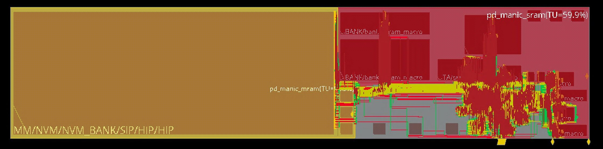

This project aims to enable a new class of intelligent, ultra-low-power computer systems
for the Internet of Things.
Future IoT applications will demand intelligence at the edge
to avoid expensive and insecure communication with the cloud.
These applications run on very low power budgets
either due to extend battery life
or because systems harvest energy from their environment.
Unfortunately, conventional, performance-oriented systems are too inefficient to run sophisticated computation (e.g., machine learning) on the device itself.

We are revisiting system design across the stack, from runtime systems to compilers to ISA to microarchitecture,
to dramatically improve energy-efficiency and enable sophisticated on-device computation.
Our Sonic software system enables energy-efficient machine learning while tolerating frequency power failures (ASPLOS'19),
and our programmable MANIC architecture eliminates most of the wasted energy in a conventional microcontroller
through a new execution model called _vector-dataflow execution_ (MICRO'19).
This project is building real prototypes, as shown above in our energy-harvesting demo for Sonic,
and shown in the image below for our upcoming tape-out of the MANIC architecture in Intel 22nm FFL.

SNAFU (ISCA'21) implements the vector-dataflow model across a spatial fabric to further reduce energy.
SNAFU is the first framework to generate ultra-low-power coarse-grained reconfigurable arrays (CGRAs)
that are optimized from the ground-up to minimize energy while maximizing flexibility
--- both design-time flexibility in hardware and run-time flexibility in software.
SNAFU allows the designer to easily customize processing elements via its “bring-your-own-functional-unit” (BYOFU) approach.
To maximize run-time flexibility in software, SNAFU provides an extensible compiler that targets generated CGRA hardware.
SNAFU consumes between 120 µW and 324 µW, depending on workload, achieving an estimated 305 MOPs/mW,
and comes within 2X-3X of ASIC energy.

This project is a collaboration with [Brandon Lucia](https://brandonlucia.com).
