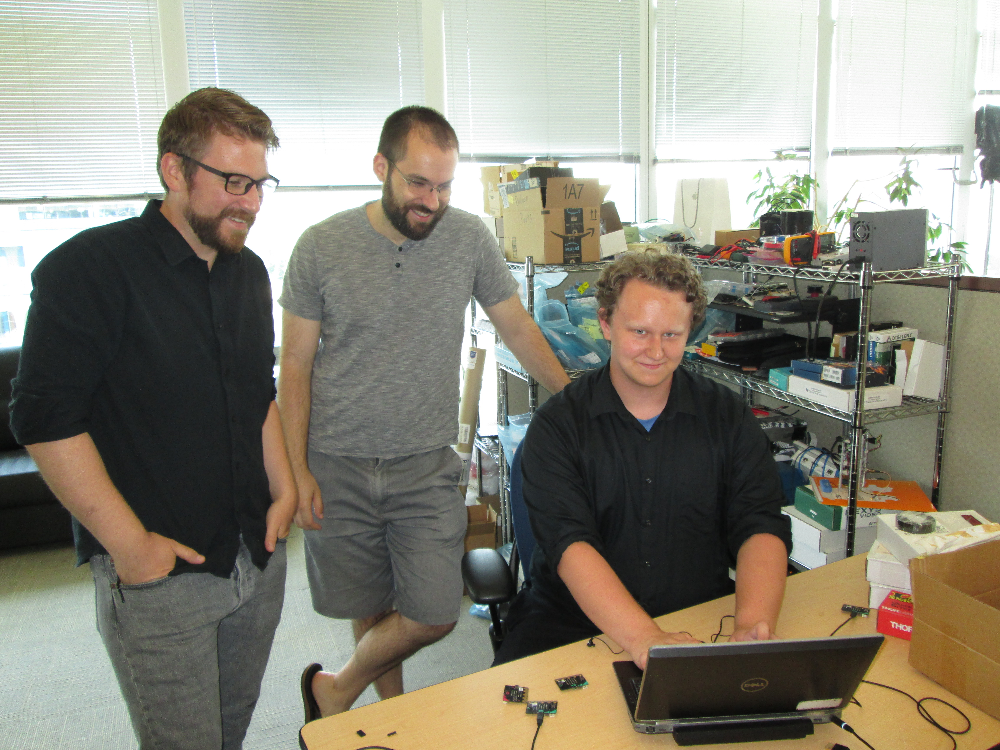

# Outreach Activities

## High-School Summer Internships

This past summer, [Brandon Lucia](https://brandonlucia.com) hosted an intern from [City High](https://cityhigh.org),
a charter high school in Pittsburgh.
The intern learned how to program embedded systems in Python using [micro:bit](https://microbit.org).
By the end of the summer, he had built programmable pieces for autonomously tracking statistics
(e.g., so character pieces in a game like DnD can track their own hit points).

## Women @ SCS

In October 2019, CORGi co-hosted a research project at [OurCS](https://www.cmu.edu/cs/ourcs/) with
the [Abstract](https://abstract.ece.cmu.edu) research group.
OurCS is a 3-day, research-focused workshop that provides opportunities for undergraduate women
from the USA and around the globe to work on exploratory problems and learn about life in graduate school.
OurCS is run by [Women@SCS](https://www.women.cs.cmu.edu).

Our workshop teaches students to program energy-harvesting embedded systems,
using tools and frameworks developed in the Abstract group.
Participants gain familiarity with computer systems research
by dealing with real challenges posed in cutting-edge systems
and using some of the tools that researchers develop to overcome these challenges.

